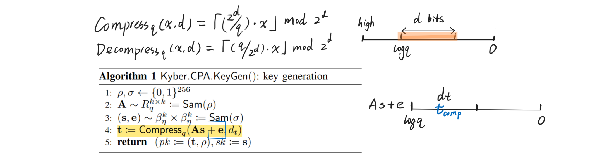

## Takeaway of comparison
SABER can be viewed as an aggressive optimization of Kyber, changing all random errors to deterministic rounding error. 

Kyber only skips one random error using LWR assumption (argued in their "Security of the real scheme" in section 3). And they use rounding (compression) just to decrease bandwidth. SABER goes further by changing all random errors to deterministic rounding error, killing both noise and compression with one stone.

Therefore, Kyber bases their security mainly on Mod-LWE, they can even maintain a reasonable security assume LWR assumption is false. SABER bases their security **solely** on LWR assumption. Therefore, NIST prefers Kyber which adds a "redundant" random noises, with only a little sacrifice of performance.

[Is Kyber redundant in its design compared to SABER?](https://crypto.stackexchange.com/q/112841/113874)

## Notations
$R_q:=\mathbb Z_q[X]/(X^n+1)$, with $n=256$ or a fixed power of 2. $\beta_\mu$ is a centered **binomial distribution** with parameter $\mu$ and corresponding standard deviation $\sigma=\sqrt{\frac \mu 2}$.

Here is the standard form of LWR, generating the noise deterministically by scaling and rounding coefficients modulo $q$ to modulo $p$ (with $p < q$). And $\ell$ is module rank.

$$\left( \mathbf a, b=\lfloor \dfrac p q(\mathbb a^\top \mathbf s)\rceil \right)\in \mathbb Z_q^{\ell\times 1}\times \mathbb Z_p$$

where $\mathbf s\leftarrow \beta_\mu(\mathbb Z_q^\ell)$, $\mathbb a\leftarrow \mathcal U(\mathbb Z_q^{\ell\times 1})$. Decisional version says it is hard to distinguish a LWR instance from a uniform one.

Mod-LWR:

$$\left( \mathbf a, b=\lfloor \dfrac p q(\mathbb a^\top \mathbf s)\rceil \right)\in R_q^{\ell\times 1}\times R_p$$

And SABER define $\text{Bits}(x,i,j)$ as the function $(x\gg (i-j+1))\&(2^j -1)$.

## SABER Key Exchange

Then the SABER key exchange is defined as follows:

where $\mathbf h$ is a constant polynomial with all coefficients equal to $h_1=2^{\epsilon_q-\epsilon_p-1}$ ( i.e. constant $h_1=\frac q{2p}$), and also another constant $h_2=2^{\epsilon_p-2}-2^{\epsilon_p-\epsilon_t-2}$ (i.e. constant $h_2=\frac p 4-\frac p{4t}$).
They are used to perform rounding with $\text{Bits}$.

**Intuition:**

1. The agreed key is at the highest bit of a symmetric pair in form of $\mathbf s^{\prime T}\mathbf A\mathbf s$ and $\mathbf s^{T}\mathbf A^T\mathbf s^{\prime}$ (an intuitive form o f $v$ and $v^{\prime}$).
2. The process of $q\rightarrow p$ rounding generates deterministic rounding error. Then the symmetric pair is computed on smaller modulo $p$ (so secrets are truncated).
3. The $t$-bit reconciliation helps to correct the rounding error, it only succeeds when the two vectors $v$ and $v^{\prime}$ are close enough, so their distance is bounded by an expression of $t$.

**Correctness**: If $\Vert v-v^{\prime}\Vert_{\infty}<\frac p4-\frac p{4t}$, then the $t$-bit reconciliation method with $h_2$ is correct, and when distance $> \frac p4+\frac p{4t}$, the reconciliation fails.

In SABER, when we explicitly write the error

$$\begin{aligned}
\text{Bits}(\mathbf A\mathbf s+\mathbf h,\epsilon_q,\epsilon_p)&=\frac p q \mathbf A\mathbf s+\mathbf e+\mathbf h, \\
\text{Bits}( \mathbf A^T\mathbf s^{\prime}+\mathbf h,\epsilon_q,\epsilon_p)& =\frac p q \mathbf A^T\mathbf s^{\prime}+\mathbf e^{\prime}+\mathbf h
\end{aligned}
$$

Then $\Vert v-v^{\prime}\Vert_{\infty}=\Vert\mathbf s^{\prime T}\mathbf e-\mathbf e^{\prime T}\mathbf s\mod p\Vert_{\infty}=\Vert\mathbf s^{\prime T}\mathbf e-\mathbf e^{\prime T}\mathbf s+e_r\Vert_{\infty}\le \frac p4$ with overwhelming probability.

**Security**

## SABER IND-CPA Encryption

## Kyber IND-CPA Encryption

## Security of Kyber

If there is no Compression and Decompression, then the security can be directly reduced to the hardness of Mod-LWE.

But to decrease the bandwidth, Kyber uses compression, which makes its security related with LWR samples. For instance, if we want to view $\left(\mathbf{t}^T \mathbf{r}+e_2\right)$ as a Mod-LWE after $t$ is compressed and decompressed, we have to assume Mod-LWR so that the current $t$ is pseudorandom. Otherwise we have to add one more random error to hide $t$ like:

$$
v = \operatorname{Compress}_q \left(\left(\mathbf{t}+\mathbf{e}^{\prime}\right)^T \mathbf{r}+e_2+\left\lceil\frac{q}{2}\right\rfloor \cdot m, d_v\right)
$$

> Without the LWR assumption, our parameter set for Kyber512 has 112 bits of core-SVP hardness – more specifically, the public keys are protected with 118 bits, and the ciphertexts with 112; with a weak version of the LWR assumption, it has 118-bit security everywhere

## Module Rank and Security

When $\ell =1$, MLWE becomes Ring-LWE. 

1. Modules with lower ranks have smaller scale of randomness and simpler structure.

2. Lattices with lower module rank may have sublattices with lower dimension, susceptible to attacks, like over streched NTRU lattices.

## Fujisaki-Okamoto Transform